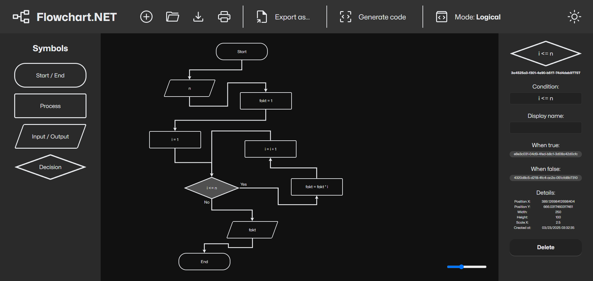

# Flowchart.NET

A web-based tool for creating flowcharts, developed as part of my Bachelor's thesis.

- **Title of Thesis:** Development of a Web Application for Creating and Editing Flowcharts
- **Thesis supervisor:** Mgr. Radim Remeš, Ph.D.

## Features

- 4 symbols - Terminal, Process, I/O, Decision
- Drag & Drop system for symbols
- Full state import & export (except simulation state)
- Simulation support
- Code generation

## Technicals

- Libraries used:
  - LeaderLine for drawing lines
  - NCalc for expression evaluation
  - BlazorMonaco for simple code view
- TypeScript modules
- Auto-deployed to GitHub Pages

The app was integrated into Blazor WebAssembly from a Razor component library project.

